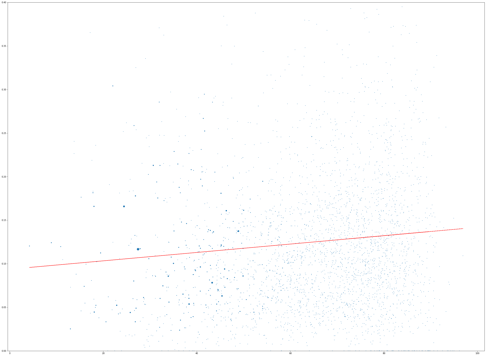

Calculate Trump's support vs. COVID-19 Deaths, on a per-county basis

- Each dot represents a single US county.
- Dot size is proportional to the population size.
- x-axis reflects the county's voting results in the 2020 presidential election. 

  The righter a county is located, the more votes Trump received (as a percent of the total Trump+Biden votes).  
  
  Left side counties are ones in which Biden received the majority of the votes.
  
- y-axis is the number of COVID-19 deaths per 100 capita.
  

Check out [the calculation notebook](README.ipynb) for details and sources.

